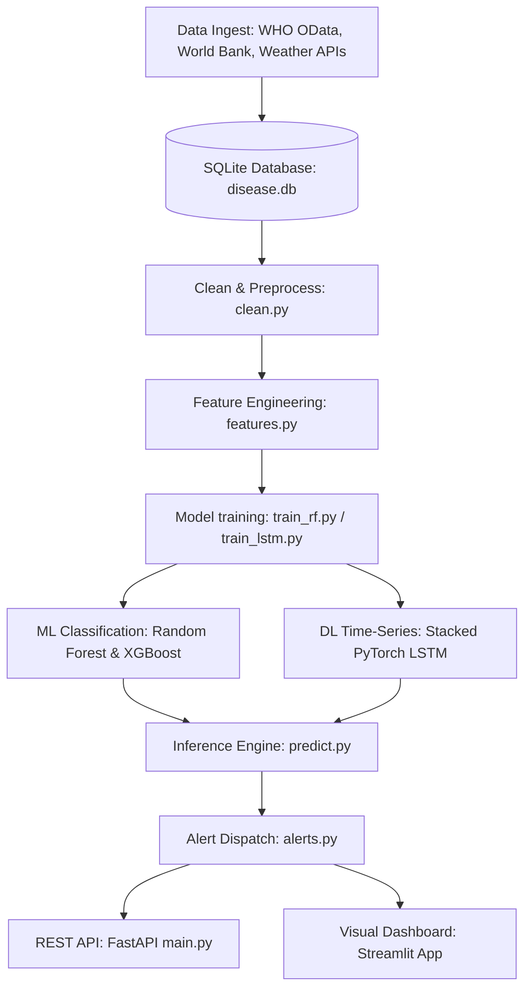

# 🦠 Global Disease Outbreak Forecasting System (GDOFS)

GDOFS is an end-to-end artificial intelligence platform designed to predict pathogen outbreak risks and forecast weekly case rates **2–8 weeks in advance**. By merging demographic indices, time-series data, and seasonal climate variables, GDOFS shifts public health surveillance from **reactive response** to **proactive early warning**.

---

## 🏗️ System Architecture



---

## 🛠️ Tech Stack & Requirements
*   **Language:** Python 3.11 / 3.14
*   **Data Science:** Pandas, NumPy, Scikit-learn
*   **Deep Learning & Boost:** PyTorch, XGBoost
*   **APIs & Server:** FastAPI, Uvicorn, SQLAlchemy, SQLite
*   **Dashboards & Mapping:** Streamlit, Folium, Plotly, Streamlit-Folium
*   **MLOps:** Docker, Github Actions, Joblib

---

## 📂 Project Directory Structure

```text
GDOFS/
|-- .github/workflows/
|   `-- mlops.yml            # CI/CD GitHub Action
|-- api/
|   `-- main.py              # FastAPI REST Service
|-- app/
|   `-- streamlit_app.py     # Streamlit Visual Dashboard
|-- config/
|   `-- config.py            # Global paths, hyperparams, coordinates
|-- data/
|   |-- raw/                 # Ingested datasets (CSV backups)
|   |-- processed/           # Preprocessed and engineered tables
|   `-- db/                  # disease.db (SQLite database)
|-- logs/                    # Operations and warning dispatches log
|-- models/                  # Saved models (.pkl, .pt) and scalers
|-- powerbi/
|   `-- README.md            # Power BI calculated columns & DAX guide
|-- src/
|   |-- ingest.py            # Ingestion & simulation data generator
|   |-- clean.py             # Data standardizer and cleaning
|   |-- features.py          # Lags and temporal features generator
|   |-- train_rf.py          # Random Forest & XGBoost classifiers
|   |-- train_lstm.py        # PyTorch Stacked LSTM trainer
|   |-- train_advanced.py    # ARIMA/SARIMA baseline validator
|   |-- predict.py           # Unified inference pipeline
|   `-- alerts.py            # Threshold checking & dispatches
|-- tests/
|   `-- test_pipeline.py     # Pytest unit testing suite
|-- Dockerfile               # Container compile instruction
|-- README.md                # System user guide
|-- requirements.txt         # Package dependencies file
|-- run_pipeline.py          # Master orchestrator execution script
`-- start.sh                 # Docker bootstrap script
```

---

## 🚀 Execution Guide

### 1. Local Environment Configuration
Initialize a virtual environment and install dependencies:
```bash
python -m venv venv
# On Windows
.\venv\Scripts\activate
# On Linux/macOS
source venv/bin/activate

pip install -r requirements.txt
```

### 2. Execute the Data and Model Pipeline
Run the master orchestrator script. This performs data ingestion, table cleaning, feature extraction, ML classifier training, deep learning sequence training, and baseline SARIMA evaluations:
```bash
python run_pipeline.py
```

### 3. Run Unit Tests
Validate pipeline steps and filtering operations:
```bash
pytest tests/
```

### 4. Launch FastAPI REST Server
Boot the API server locally:
```bash
uvicorn api.main:app --reload
```
Open **[http://127.0.0.1:8000/docs](http://127.0.0.1:8000/docs)** in your browser to view the interactive Swagger API documentation.

### 5. Launch the Streamlit Dashboard
Run the visual interface:
```bash
streamlit run app/streamlit_app.py
```
Open **[http://localhost:8501](http://localhost:8501)** in your browser to interact with metrics, forecasts, maps, and explanation logs.

---

## 🐳 Docker Deployment
Build the image and spin up the multi-service container (ports 8000 and 8501):
```bash
docker build -t gdofs-system:latest .
docker run -p 8000:8000 -p 8501:8501 gdofs-system:latest
```

---

## 🔌 API Endpoints Reference
*   `GET /countries`: Returns a dictionary list of tracked countries and diseases.
*   `POST /predict`: Classifies outbreak risk (returns Risk Level: Low/Medium/High/Critical).
*   `POST /forecast`: Returns multi-week case-rate predictions from the LSTM.
*   `GET /risk`: Retrieves the latest risk level stored for a target.
*   `GET /alerts`: Fetches recent alerts triggered by the system.

---

## 💻 Recommended VS Code Extensions
To inspect and manage the codebase efficiently, we recommend installing:
1. **Python** & **Pylance**: For syntax validation and type check autocomplete.
2. **Jupyter**: To run exploratory analysis blocks.
3. **Rainbow CSV**: For easy reading of columns in `raw` and `processed` tables.
4. **SQLite Viewer**: To inspect database tables (`who_diseases`, `weather`, `population`, `features`, `alerts`) inside the editor.
